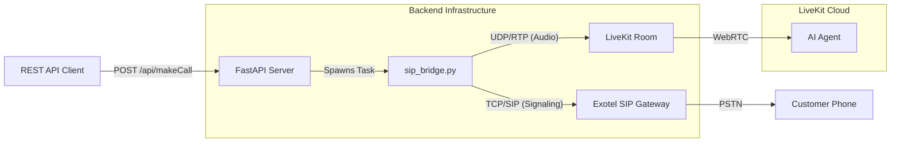

# Exotel SIP Bridge Architecture and Usage

## 1. Overview

This document details the custom SIP Bridge implementation for Exotel (`sip_bridge.py`) used to bypass standard LiveKit SIP trunk limitations.

## 2. Architecture

The standard LiveKit SIP Trunk integration runs entirely in the cloud. However, due to specific signaling requirements for Exotel (manual headers, TCP transport specifics), we implemented a **Local SIP Bridge**.

### Diagram



### Components

1.  **`sip_bridge.py`**: A custom Python script that:
    - Acts as a SIP User Agent (Softphone).
    - Establishes a SIP call with Exotel using `INVITE` -> `200 OK` -> `ACK`.
    - Joins the LiveKit Room as a participant ("Phone User").
    - Bridges audio (bidirectional) between the SIP UDP socket and the LiveKit Room.
2.  **`outbound/outbound_call.py`**: The orchestrator.
    - When `call_from="exotel"` is detected, it triggers `sip_bridge.py` instead of the standard LiveKit SIP Trunk method.

## 3. How to Trigger via API

You can trigger calls for multiple agents using the same centralized API endpoint used for Twilio.

### Endpoint

`POST /api/makeCall`

### Payload

```json
{
  "phone_number": "08697421450",
  "agent_type": "invoice",
  "call_from": "exotel"
}
```

- **`phone_number`**: The destination number.
- **`agent_type`**: The ID of the agent to use (e.g., `invoice`, `restaurant`, `harry_potter`).
- **`call_from`**: Set to `"exotel"` to use the custom SIP bridge. If set to `"twilio"`, it uses the standard LiveKit SIP Trunk.

### Response

```json
{
  "status": 0,
  "message": "SIP Bridge initiated",
  "data": {
    "room": "sip-bridge-08697421450-...",
    "agent": "invoice",
    "status": "bridging"
  }
}
```

## 4. Supporting Multiple Agents

The system supports any agent defined in your `AGENT_TYPES` map (in `agent_session.py`).

1.  **Frontend/API** sends `agent_type` (e.g., `"bank"`).
2.  **Server** spawns `sip_bridge.py` with this `agent_type`.
3.  **Bridge** creates a room and dispatch request with `metadata={"agent": "bank"}`.
4.  **`agent_session.py`** reads the metadata/room name and initializes the `BankingAgent`.

No additional configuration is needed per agent; just pass the correct string ID in the API request.

## 5. Technical Details (`sip_bridge.py`)

- **Signaling**: Implements manual SIP handshake (INVITE/ACK) over TCP.
- **Media**:
  - Listens on UDP port `18232` (configurable).
  - Transcodes incoming G.711 PCMu audio to 48kHz PCM for LiveKit.
  - Transcodes outgoing LiveKit audio to G.711 PCMu for Exotel.
- **Concurrency**: Runs as an asyncio task within the FastAPI event loop when triggered via API.
